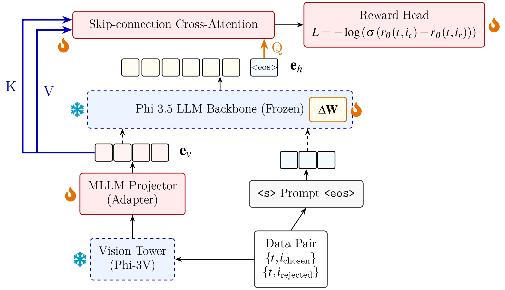
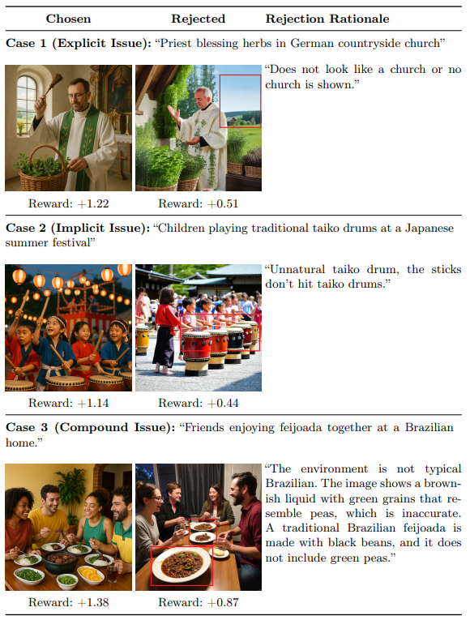

# Implicit Cultural Alignment Reward Model

This repository provides the core architecture and evaluation pipeline for the Implicit Cultural Alignment Reward Model. Built upon the Phi-3.5-vision architecture and optimized with DeepSpeed and LoRA, this framework is designed to evaluate and align Multimodal Large Language Models (MLLMs) with nuanced cultural expectations.

## Architecture



Our framework integrates an Implicit Cultural Probe with a Skip-connection Cross-Attention (SkipCA) mechanism. This design enables late-stage semantic features to directly attend to early-stage visual representations, better preserving culturally salient details. By bypassing autoregressive text generation, the model processes each evaluation efficiently in 0.21 seconds under our local inference setup, achieving a 10x speedup over standard VQA-based evaluators.

## Dataset

This project utilizes the **CulturalFrames** dataset to evaluate cultural biases and human expectations in text-to-image generation and multimodal understanding.

* **Dataset Link**: [CulturalFrames on Hugging Face](https://huggingface.co/datasets/mair-lab/CulturalFrames)

## Model Weights

To maintain a lightweight and clean Git history, the fine-tuned LoRA adapters and model checkpoints are hosted on Hugging Face.

* **Model Repository**: [Bensonch/phi35_cultural_reward](https://huggingface.co/Bensonch/phi35_cultural_reward)

## Qualitative Results



The reward model assigns continuous scalar rewards that closely align with the nuanced critiques provided by native human annotators. It effectively penalizes generated images that exhibit explicit prompt mismatches, implicit cultural incongruities, or compound issues.

## Acknowledgements

This work was supported by the MOE Yushan Young Scholar Program under Grant MOE-114-YSFEE-0010-008-P1 and NSTC Taiwan under Grant NSTC 115-2813-C-A49-146-E. 

We thank the excellent research and open-source works that made this project possible, including Phi-3.5-vision, DeepSpeed, and LoRA. We also deeply acknowledge the datasets and theoretical frameworks that support our cultural understanding components, including the CulturalFrames benchmark, the World Values Survey (WVS), and CulturalAtlas.

## Citation

If you find this repository or our reward model useful in your research, please consider citing our work:

```bibtex
@misc{chang2026debiasing,
  title={Debiasing Text-to-Image Evaluation via Implicit Cultural Alignment Reward Modeling},
  author={Bo-An Chang and Yu-Chih Chen},
  year={2026},
  eprint={XXXX.XXXXX}, 
  archivePrefix={arXiv},
  primaryClass={cs.CV},
  url={[https://arxiv.org/abs/XXXX.XXXXX](https://arxiv.org/abs/XXXX.XXXXX)}
}

## Contacts

* **Bo-An Chang**: boanzhang82@gapp.nthu.edu.tw 
* **Yu-Chih Chen**: berriechen@nycu.edu.tw 
